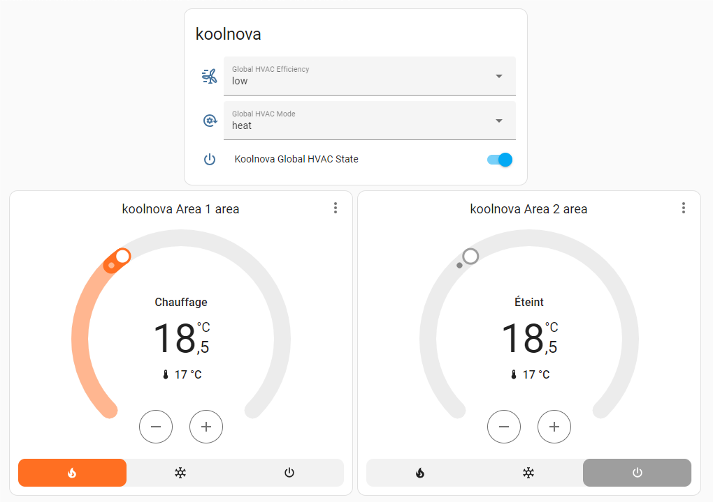
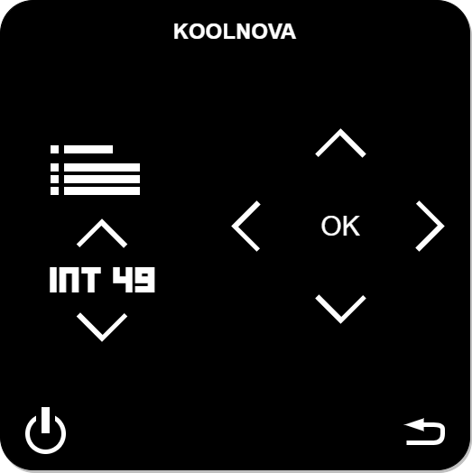
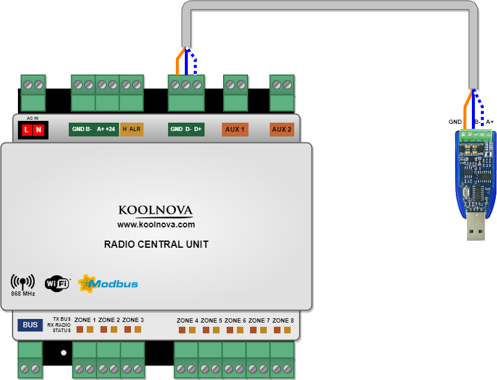
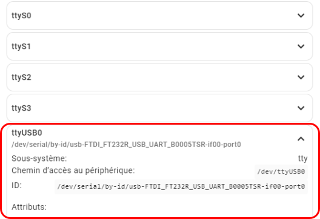

# koolnova-BMS-Integration

_Disclaimer : This is not a Koolnova official integration and use at your own risk._

**koolnova-BMS-integration** is an integration of koolnova system into Home Assistant using BMS (Building Management System) and Modbus RTU (RS485) protocol.

## Building Management System (BMS)

With BMS, owners can monitor and manage systems, such as air conditioning, heating, ventilation, lighting or energy supply systems.
Some objectives of building automation are improved occupant comfort, efficient operation of building systems, reduction in energy consumption, reduced operating and maintaining costs and increased security.

Most building automation networks consist of a primary and secondary bus which connect high-level controllers with low-level controllers, input/output devices and a user interface.
Physical connectivity between devices waq historically provided by dedicated optical fiber, ethernet, ARCNET, RS-232, **RS-485** or a low-bandwidth special purpose wireless network.

## Modbus RTU

**Modbus** is a client/server data communications protocol in the application layer of the OSI model. Modbus was developped for industrial applications, is relatively easy to deploy and maintain compared to other standards, and places few restrictions on the format of the data to be transmitted.

Communication standards or buses which is deployed for Modbus communication are:
* TCP/IP over Ethernet
* Asynchronous serial communication in a wide range of standards, technologies : EIA/TIA-232-E, EIA-422, EIA/TIA-485-A, fiber, radio frequency.
* Modbus PLUS, a high speed token passing network

Modbus standard defines MODBUS over Serial Line, a protocol over the Data link layer of the OSI model for the Modbus application layer protocol to be communicated over a serial bus. Modbus Serial Line protocol is a master/slave protocol which supports one master and multiple slaves in the serial bus.
A serial bus for Modbus over Serial Line can maximum 247 slaves to communicate with 1 master, those slaves then must their unique address range from 1 to 247.
Modbus over Serial Line has two transmission modes RTU and ASCII which are corresponded to two versions of the protocol, known as Modbus RTU and Modbus ASCII.

Modbus RTU (Remote Terminal Unit), makes use of a compact, binary representation of the data for protocol communication. The RTU format follows the commands/data with a cyclic redundancy check checksum as an error check mecahnism to ensure the reliability of data.

# Getting Started

## Requirements

* An installation of Home Assistant with free USB port.
* A RS485 USB dongle.
* Enabling Modbus communication on the thermostat (INT 49)

## Connecting

* Controller D+ to USB dongle A+
* Controller D- to USB dongle B-
* Controller GND to USB dongle GND

## Installation

Install using HACS In HACS go to the three dots int the upper right corner choose add custom repository and add https://github.com/sinseman44/koolnova-BMS-Integration to the list.

Install manually Clone or copy this repository and copy the folder 'custom_components/koolnova-BMS-integration' into '/custom_components/koolnova-BMS-integration'

## Home Assistant USB dongle recognition

After plugging the USB dongle into the system, check that among the tty, it's recognized by Home Assistant.
Example : ttyUSB0 is the node added for the device

